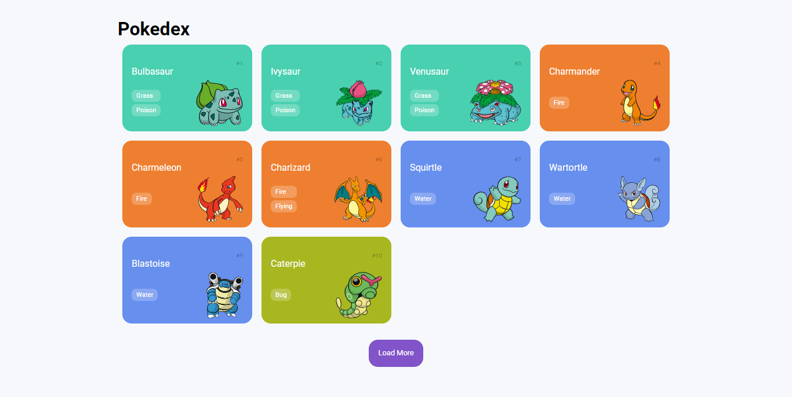

<h1 align="center">Projeto Pokedex</h1>

Projeto desenvolvido durante curso de JavaScript da DIO, onde nos foi proposto desenvolver, junto ao instrutor, uma pokedex e consumir uma API.

 

    

 
<h2>💻 Tecnologias</h2>
<ul>
    <li>HTML e CSS</li>
    <li>JavaScript</li>
    <li>Normalize CSS</li>
    <li>PokeApi</li>
</ul>
